# 📊 Database Entity Relationship Diagram (ERD)

Biểu đồ này được tạo tự động dựa trên cấu trúc database hiện tại của dự án K-T-T01.
Bạn có thể xem trực tiếp biểu đồ này trên GitHub hoặc trong VS Code (cài đặt extension **Markdown Preview Mermaid Support**).

```mermaid
erDiagram

    %% ==========================================
    %% CORE MODULE
    %% ==========================================
    User {
        uuid id PK
        string email
        string password
        string first_name
        string last_name
        string phone_number
        boolean is_active
        boolean is_two_factor_enabled
        datetime last_login_at
    }

    Role {
        uuid id PK
        string name
        string description
    }

    Permission {
        uuid id PK
        string slug
        string description
    }

    ManagerProfile {
        uuid id PK
        uuid user_id FK
        string department
    }

    SystemSetting {
        uuid id PK
        string key
        string value
    }

    %% Relationships
    User ||--o{ UserRole : has
    Role ||--o{ UserRole : assigned_to
    Role ||--o{ RolePermission : has
    Permission ||--o{ RolePermission : assigned_to
    User ||--o| ManagerProfile : has_profile

    %% ==========================================
    %% CHAT MODULE
    %% ==========================================
    Conversation {
        uuid id PK
        string type "direct/group"
        string title
        uuid last_message_id FK
    }

    Message {
        uuid id PK
        uuid conversation_id FK
        uuid sender_id FK
        text content
        string type "text/image/file/voice"
        uuid parent_message_id FK
        boolean is_edited
    }

    ConversationMember {
        uuid id PK
        uuid conversation_id FK
        uuid user_id FK
        string role "admin/member"
        datetime last_read_at
    }

    MessageReaction {
        uuid id PK
        uuid message_id FK
        uuid user_id FK
        string emoji
    }

    PinnedMessage {
        uuid id PK
        uuid conversation_id FK
        uuid message_id FK
        uuid pinned_by_user_id FK
    }

    %% Relationships
    User ||--o{ Message : sends
    Conversation ||--o{ Message : contains
    Conversation ||--o{ ConversationMember : has_members
    User ||--o{ ConversationMember : joins
    Message ||--o{ MessageReaction : has_reactions
    User ||--o{ MessageReaction : reacts
    Conversation ||--o{ PinnedMessage : has_pins
    Message ||--o{ PinnedMessage : is_pinned

    %% ==========================================
    %% FILE STORAGE MODULE
    %% ==========================================
    File {
        uuid id PK
        string original_name
        string mime_type
        int size
        string storage_path
        uuid owner_id FK
        uuid folder_id FK
    }

    Folder {
        uuid id PK
        string name
        uuid parent_id FK
        uuid owner_id FK
    }

    FileShare {
        uuid id PK
        uuid file_id FK
        uuid shared_with_user_id FK
        datetime expires_at
    }

    FileVersion {
        uuid id PK
        uuid file_id FK
        string storage_path
        int version_number
    }

    %% Relationships
    User ||--o{ File : owns
    User ||--o{ Folder : owns
    Folder ||--o{ File : contains
    Folder ||--o{ Folder : sub_folders
    File ||--o{ FileVersion : has_versions
    File ||--o{ FileShare : shared_via

    %% ==========================================
    %% SECURITY MODULE
    %% ==========================================
    AuditLog {
        uuid id PK
        uuid user_id FK
        string action
        string entity_type
        string ip_address
    }

    UserSession {
        uuid id PK
        uuid user_id FK
        string device_id
        string ip_address
        boolean is_active
    }

    EncryptionKey {
        uuid id PK
        uuid user_id FK
        string public_key
        string encrypted_private_key
    }

    SecurityEvent {
        uuid id PK
        string event_type
        string severity
        json details
    }

    %% Relationships
    User ||--o{ AuditLog : generates
    User ||--o{ UserSession : has_sessions
    User ||--o{ EncryptionKey : has_keys

    %% ==========================================
    %% TEAM & PROJECT MODULE
    %% ==========================================
    Team {
        uuid id PK
        string name
        string description
    }

    Project {
        uuid id PK
        uuid team_id FK
        string name
        string status
    }

    Task {
        uuid id PK
        uuid project_id FK
        uuid assignee_id FK
        string title
        string status
        datetime due_date
    }

    %% Relationships
    Team ||--o{ TeamMember : has_members
    User ||--o{ TeamMember : joins
    Team ||--o{ Project : owns
    Project ||--o{ Task : contains
    User ||--o{ Task : assigned_to

```

## 📝 Hướng dẫn xem
1. **GitHub**: File này sẽ tự động hiển thị dưới dạng biểu đồ trên GitHub.
2. **VS Code**:
   - Cài đặt extension: `Markdown Preview Mermaid Support`
   - Bấm `Ctrl + Shift + V` (hoặc `Cmd + Shift + V` trên Mac) để xem preview.
3. **Các công cụ khác**: Có thể copy nội dung trong khối `mermaid` và dán vào [Mermaid Live Editor](https://mermaid.live).
