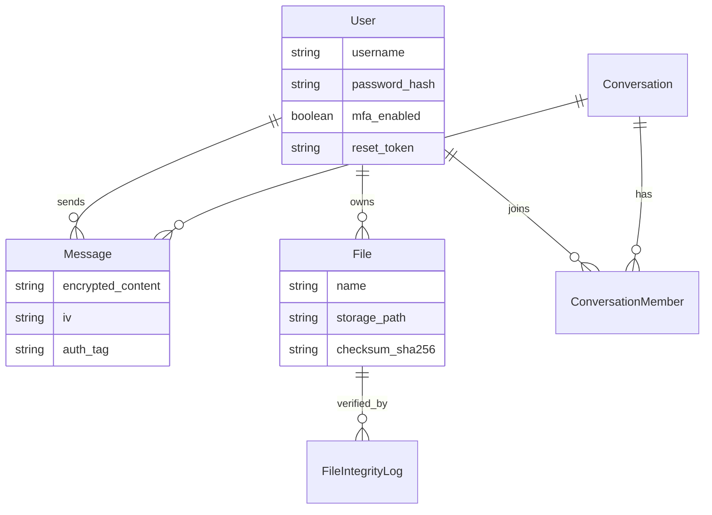

# CyberSecure Enterprise Platform (K-T-T01)

<div align="center">


**Hệ thống quản lý giao tiếp và tài liệu nội bộ doanh nghiệp với bảo mật cấp cao**

[Tính năng](#tính-năng-chính) | [Cài đặt nhanh](#cài-đặt-nhanh) | [Hướng dẫn chi tiết](#hướng-dẫn-chi-tiết) | [Bảo mật](#security-best-practices)

</div>

---

## Giới thiệu

**CyberSecure Enterprise Platform (CSEP)** là hệ thống web quản lý giao tiếp và tài liệu nội bộ doanh nghiệp, tích hợp các cơ chế an ninh mạng nâng cao theo mô hình **Zero Trust Architecture**.

### Mục tiêu dự án
- Xây dựng hệ thống chat nội bộ với **Mã hóa Đầu-cuối (E2EE)**.
- Quản lý tài liệu an toàn tuyệt đối với **Mã hóa AES-256-GCM**.
- Triển khai **Xác thực đa yếu tố (MFA)** và Quản lý quyền hạn **RBAC**.
- Giám sát bảo mật theo thời gian thực (real-time) với **Audit Logging**.
- Tạo lập một hệ quy chiếu (Proof-of-concept) cho Cybersecurity trong doanh nghiệp hiện đại.

---

## Tính năng chính

### Chat & Messaging (Telegram-style)
- Nhắn tin thời gian thực với WebSocket siêu tốc.
- Mã hóa End-to-End (AES-256-GCM).
- Hỗ trợ Chat 1-1 và Group Chat.
- **Reply** (Trả lời tin nhắn).
- **Edit** (Chỉnh sửa tin nhắn).
- **Forward** (Chuyển tiếp tin nhắn).
- **Delete** (Xóa tin nhắn).
- **Pin** (Ghim tin nhắn quan trọng).
- **Reactions** (Thả cảm xúc).
- **Read Receipts** (Trạng thái đã đọc/Đang gõ).
- **Voice Messages** (Tin nhắn thoại).
- **File Sharing** (Giao thức chia sẻ tệp mã hóa).

### File Management
- Upload/Download luồng tệp được mã hóa tức thời.
- **Secure Vault** (Kho lưu trữ bảo mật cá nhân).
- Quản lý phiên bản tệp (File versioning).
- Phân quyền chia sẻ tài liệu nội bộ.
- Kiểm tra tính toàn vẹn của tệp dựa trên thuật toán mã băm **SHA-256**.

### Security & Authentication
- Xác thực bằng **JWT (JSON Web Tokens)**.
- **Multi-Factor Authentication (MFA)** sử dụng mã TOTP.
- Cấp quyền theo vai trò **Role-Based Access Control (RBAC)**.
- Theo dõi và thu hồi Phiên đăng nhập (Session Management).
- Chống tấn công dò mật khẩu (Brute-force Protection) đi kèm **Tính năng Khóa tài khoản (Account Lockout)** đếm ngược thời gian.
- **Quy trình Quên mật khẩu an toàn (Secure Password Reset Flow)** thông qua Email tự động với Token một lần (OTP/Hashed Token).
- Ghi log kiểm toán toàn diện (Audit Logging) và Security Dashboard.

---

## Kiến trúc hệ thống

```text
+-------------------------------------------------------------+
|                    Frontend (React.js)                      |
|              Port 3000 | Cloudflare Tunnel                  |
+-------------------------------------------------------------+
|                   Backend API (NestJS)                      |
|              Port 3001 | RESTful + WebSocket                |
+-------------------------------------------------------------+
|                   Database (MySQL 8.0)                      |
|                        Port 3307                            |
+-------------------------------------------------------------+
|                  File Storage (Local/S3)                    |
|                   Encryption Layer                          |
+-------------------------------------------------------------+
```

### Database Schema Overview

Hệ thống sử dụng **35 bảng** được thiết kế chặt chẽ. Dưới đây là sơ đồ quan hệ của các thực thể chính trong luồng giao tiếp và bảo mật:



---

## Tech Stack & Công nghệ sử dụng

Dự án được xây dựng trên bộ công nghệ Web hiện đại, định hướng Enterprise:

### Frontend (User Interface)


- **React.js 18** - UI Framework chính, thiết kế theo phong cách Premium (Glassmorphism, mượt mà).
- **Vanilla CSS** - Styling tối ưu tốc độ, không dùng thư viện rườm rà cồng kềnh.
- **Lucide React** - Hệ thống biểu tượng SVG đồng nhất và sắc nét.

### Backend (Server & API)


- **NestJS (Node.js)** - Framework Back-end cấp doanh nghiệp với kiến trúc Module rõ ràng.
- **TypeScript** - Ngôn ngữ lập trình khắt khe về Type-Safety, giảm thiểu lỗi runtime.
- **WebSocket (Socket.IO)** - Luồng giao tiếp 2 chiều siêu tốc dành cho hệ thống Chat thực.
- **Nodemailer** - Tích hợp hệ thống phân phối Email tự động (Password Reset OTP).

### Database & Storage


- **MySQL 8.0** - Cơ sở dữ liệu quan hệ ổn định và đáng tin cậy.
- **TypeORM** - Mapping dữ liệu Object sang Relational mượt mà.
- **Local File System** - Phân vùng lưu trữ tệp đính kèm và tài liệu bị mã hóa theo tiêu chuẩn.

### Security, Cryptography & DevOps


- **Bcrypt & JWT** - Nền tảng mã hóa mật khẩu và cấp Token phiên đăng nhập.
- **Node Crypto (AES-256-GCM)** - Sinh khóa và mã hóa toàn bộ dữ liệu (Tin nhắn & Files).
- **Docker & Docker Compose** - Đóng gói môi trường toàn dự án chỉ bằng 1 câu lệnh.
- **Cloudflare Tunnels** - Biến localhost thành link Internet toàn cầu mà không cần trỏ Domain hay cấu hình NAT.

---

## Cài đặt nhanh

### Yêu cầu hệ thống
- Node.js >= 18.0.0
- Docker & Docker Compose
- Git
- 4GB RAM (Khuyến nghị)

### Quick Start (3 bước)

```bash
# 1. Clone repository
git clone https://github.com/Wendy84205/K-T-T01.git
cd K-T-T01

# 2. Khởi động với Docker
docker-compose up --build -d

# 3. Truy cập ứng dụng
# Frontend: http://localhost:3000
# Backend:  http://localhost:3001
```

**Tài khoản mặc định:**
- Email: `admin@cybersecure.com`
- Password: `Admin@123` *(Hoặc mật khẩu anh/chị vừa thay đổi thông qua tính năng Reset)*

---

## Hướng dẫn chi tiết

### Phương án 1: Chạy với Docker (Khuyến nghị)

#### Bước 1: Khởi động services
```bash
docker-compose down
docker-compose up --build -d
```

#### Bước 2: Kiểm tra trạng thái
```bash
docker-compose ps
docker logs -f cybersecure-backend
```

#### Bước 3: Đợi Database Migration hoàn tất
```bash
docker logs cybersecure-migrate
# Khi thấy "Migration completed successfully" là hệ thống đã sẵn sàng.
```

---

### Phương án 2: Chạy Local (Để lập trình & phát triển)

#### Bước 1: Khởi động MySQL ảo
```bash
docker-compose up -d mysql
```

#### Bước 2: Khởi động Backend
```bash
cd backend
npm install
npm run start:dev
# Backend sẽ chạy tại http://localhost:3001
```

#### Bước 3: Khởi động Frontend
```bash
cd frontend
npm install
npm start
# Frontend sẽ mở tại http://localhost:3000
```

---

## Expose ra Internet với Cloudflare Tunnel

Hệ thống có đi kèm kịch bản bash để tự động tạo domain ảo (VD: `*.trycloudflare.com`) giúp truy cập dễ dàng.

```bash
# Cấp quyền và chạy scripts tự động kết nối Backend/Frontend
chmod +x scripts/start-tunnels.sh
./scripts/start-tunnels.sh
```
> Kịch bản này sẽ tự động sinh URL và ghi đè cấu hình `API_BASE_URL` của Frontend để lập tức chạy được trên thiết bị khác (Mobile/Tablet/PC).

---

## Security Best Practices

### Các rào chắn đã triển khai
1. **Quản lý Token:** Tự động thu hồi JWT Token đã hết hạn / đăng xuất.
2. **Mật khẩu an toàn:** Băm mật khẩu sử dụng `bcrypt` với cost rounds tiêu chuẩn.
3. **Mã hóa tệp tin:** Mã hóa nội dung tệp ở chế độ nghỉ (Encryption at Rest) thông qua AES-256-GCM, kết hợp xác thực tính toàn vẹn với mã băm chữ ký SHA-256.
4. **Phân quyền truy cập đa cấp bậc:** Quản trị viên (Admin), Quản lý dự án (Manager) và Nhân sự (User).
5. **Giám sát mối đe dọa:** Hệ thống nhật ký toàn vẹn (Audit Logs) ghi chép định kỳ lưu lượng truy cập. Cảnh báo đăng nhập thất bại liên tục (Lockout countdown).
6. **Mã hóa Tin nhắn E2EE:** Đảm bảo chỉ những người có mã khóa tham gia cuộc trò chuyện mới có khả năng giải mã tin nhắn trên máy tính của họ (Client-side decryption).

---

## Liên hệ & Hỗ trợ
Mọi thắc mắc và đóng góp bảo trì hệ thống, vui lòng tham khảo file thiết kế hệ thống tại thư mục `/docs`.

**License:** MIT