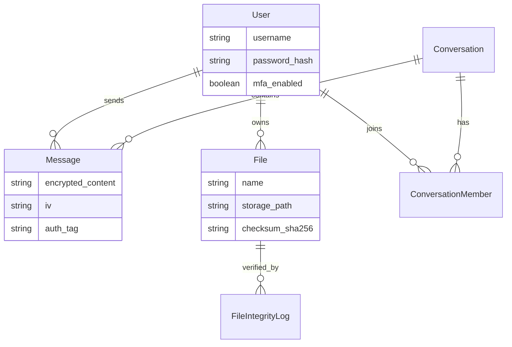

# CyberSecure Enterprise Platform (K-T-T01)

<div align="center">


**He thong quan ly giao tiep va tai lieu noi bo doanh nghiep voi bao mat cap cao**

[Tinh nang](#tinh-nang-chinh) | [Cai dat nhanh](#cai-dat-nhanh) | [Huong dan chi tiet](#huong-dan-chi-tiet) | [API Documentation](#api-documentation)

</div>

---

## Gioi thieu

**CyberSecure Enterprise Platform (CSEP)** la he thong web quan ly giao tiep va tai lieu noi bo doanh nghiep, tich hop cac co che an ninh mang nang cao theo mo hinh **Zero Trust Architecture**.

### Muc tieu du an
- Xay dung he thong chat noi bo voi **ma hoa end-to-end (E2EE)**
- Quan ly tai lieu an toan voi **ma hoa AES-256-GCM**
- Trien khai **xac thuc da yeu to (MFA)** va **RBAC**
- Giam sat bao mat real-time voi **audit logging**
- Proof-of-concept cho cybersecurity trong doanh nghiep

---

## Tinh nang chinh

### Chat & Messaging (Telegram-style)
- Nhan tin real-time voi WebSocket
- Ma hoa end-to-end (AES-256-GCM)
- Chat 1-1 va Group Chat
- **Reply** (tra loi tin nhan)
- **Edit** (chinh sua tin nhan)
- **Forward** (chuyen tiep tin nhan)
- **Delete** (xoa tin nhan)
- **Pin** (ghim tin nhan quan trong)
- **Reactions** (tha cam xuc)
- **Read Receipts** (trang thai da doc)
- **Voice Messages** (tin nhan thoai)
- **Typing Indicator** (dang soan tin...)
- **File Sharing** (chia se file ma hoa)

### Voice & Video Call
- Goi thoai (Voice Call)
- Goi video (Video Call)
- Trang thai cuoc goi real-time

### File Management
- Upload/Download file ma hoa
- Secure Vault (kho luu tru bao mat)
- File versioning
- File sharing voi quyen han
- Kiem tra tinh toan ven (SHA-256)

### Security & Authentication
- JWT Authentication
- Multi-Factor Authentication (MFA/2FA)
- Role-Based Access Control (RBAC)
- Session Management
- Rate Limiting & Brute-force Protection
- Audit Logging
- Security Dashboard

### User Management
- User profiles
- Role management (Admin/Manager/User)
- Permission system
- User activity tracking

---

## Kien truc he thong

```
+-------------------------------------------------------------+
|                    Frontend (React.js)                      |
|              Port 3000 | Cloudflare Tunnel                  |
+-------------------------------------------------------------+
|                   Backend API (NestJS)                      |
|              Port 3001 | RESTful + WebSocket                |
+-------------------------------------------------------------+
|                   Database (MySQL 8.0)                      |
|                        Port 3307                            |
+-------------------------------------------------------------+
|                  File Storage (Local/S3)                    |
|                   Encryption Layer                          |
+-------------------------------------------------------------+
```

### Database Schema Overview

He thong su dung **35 bang** duoc thiet ke chat che. Duoi day la so do quan he cac thuc the chinh:



---

## Tech Stack

### Frontend
- **React.js 18** - UI Framework
- **Vanilla CSS** - Styling (Modern design)
- **WebSocket** - Real-time communication
- **Axios** - HTTP client
- **React Router v6** - Navigation
- **Lucide React** - Icon library

### Backend
- **NestJS** - Node.js framework
- **TypeScript** - Type-safe development
- **MySQL 8.0** - Relational database
- **TypeORM** - ORM
- **JWT** - Authentication
- **Crypto** - Encryption (AES-256-GCM)
- **Winston** - Logging

### DevOps & Tools
- **Docker & Docker Compose** - Containerization
- **Cloudflare Tunnel** - Public access
- **PM2** - Process management
- **MySQL Workbench** - Database management

---

## Cai dat nhanh

### Yeu cau he thong
- Node.js >= 18.0.0
- Docker & Docker Compose
- Git
- 4GB RAM (khuyen nghi)

### Quick Start (3 buoc)

```bash
# 1. Clone repository
git clone https://github.com/your-username/K-T-T01.git
cd K-T-T01

# 2. Khoi dong voi Docker
docker-compose up -d

# 3. Truy cap ung dung
# Frontend: http://localhost:3000
# Backend: http://localhost:3001
```

**Tai khoan mac dinh:**
- Email: admin@cybersecure.com
- Password: Admin@123

---

## Huong dan chi tiet

### Phuong an 1: Chay voi Docker (Khuyen nghi)

#### Buoc 1: Clone va chuan bi
```bash
git clone https://github.com/your-username/K-T-T01.git
cd K-T-T01
docker --version
docker-compose --version
```

#### Buoc 2: Khoi dong services
```bash
docker-compose up -d
docker-compose logs -f
docker-compose ps
```

#### Buoc 3: Cho database migration hoan tat
```bash
docker logs cybersecure-migrate
# Khi thay "Migration completed successfully" la OK
```

#### Buoc 4: Truy cap ung dung
- Frontend: http://localhost:3000
- Backend API: http://localhost:3001/api/v1
- API Health: http://localhost:3001/health

#### Buoc 5: Dang nhap
- Email: admin@cybersecure.com
- Password: Admin@123

---

### Phuong an 2: Chay local (Development)

#### Buoc 1: Cai dat dependencies
```bash
# Backend
cd backend
npm install

# Frontend (terminal moi)
cd frontend
npm install
```

#### Buoc 2: Khoi dong MySQL voi Docker
```bash
docker-compose up -d mysql
docker-compose ps
```

#### Buoc 3: Chay migration
```bash
cd backend
cat > .env << EOF
NODE_ENV=development
PORT=3001
DB_HOST=localhost
DB_PORT=3307
DB_USERNAME=root
DB_PASSWORD=password
DB_DATABASE=cybersecure_db
JWT_SECRET=dev-secret-key-for-development-only-change-this
EOF

npm run migration:run
```

#### Buoc 4: Khoi dong Backend
```bash
npm run start:dev
# Backend se chay tai http://localhost:3001
```

#### Buoc 5: Khoi dong Frontend
```bash
cd frontend
cat > .env << EOF
REACT_APP_API_URL=http://localhost:3001/api/v1
EOF

npm start
# Frontend se mo tai http://localhost:3000
```

---

## Expose ra Internet voi Cloudflare Tunnel

### Cai dat Cloudflared
```bash
# macOS
brew install cloudflared
```

### Khoi dong tunnels
```bash
./start-tunnels.sh
# Hoac chay thu cong:
# cloudflared tunnel --url http://localhost:3000  # Frontend
# cloudflared tunnel --url http://localhost:3001  # Backend
```

### Kiem tra trang thai
```bash
./check-tunnels.sh
```

Xem huong dan chi tiet tai: [CLOUDFLARE_TUNNEL_GUIDE.md](./CLOUDFLARE_TUNNEL_GUIDE.md)

---

## Cau truc du an

```
K-T-T01/
|-- frontend/                    # React Frontend
|   |-- src/
|   |   |-- components/           # Reusable components
|   |   |-- pages/               # Page components
|   |   |-- context/             # React Context
|   |   |-- utils/               # Utilities & API client
|-- backend/                     # NestJS Backend
|   |-- src/
|   |   |-- modules/             # Feature modules
|   |   |-- database/
|   |   |-- guards/             # Auth guards
|-- docker/                      # Docker configs
|-- logs/                        # Application logs
|-- uploads/                     # Uploaded files (encrypted)
|-- docker-compose.yml          # Docker Compose config
|-- README.md                   # This file
```

---

## Scripts huu ich

### Backend Scripts
```bash
npm run start:dev          # Chay dev mode
npm run build              # Build production
npm run test               # Run unit tests
npm run migration:run      # Chay migrations
```

### Frontend Scripts
```bash
npm start                  # Development server
npm run build              # Build production
```

---

## Security Best Practices

### Da trien khai
- JWT voi expiration
- Password hashing (bcrypt)
- MFA/2FA
- RBAC
- Rate limiting
- Input validation
- SQL injection prevention
- XSS/CSRF protection
- Encryption at rest (AES-256-GCM)
- Audit logging

---

## Changelog

### Version 1.0.0 (2026-02-03)
- Initial release
- Complete chat system with E2EE
- File management with encryption
- MFA/2FA authentication
- RBAC implementation
- Security dashboard
- Audit logging
- Docker deployment
- Cloudflare Tunnel integration

---

## License
This project is licensed under the MIT License.