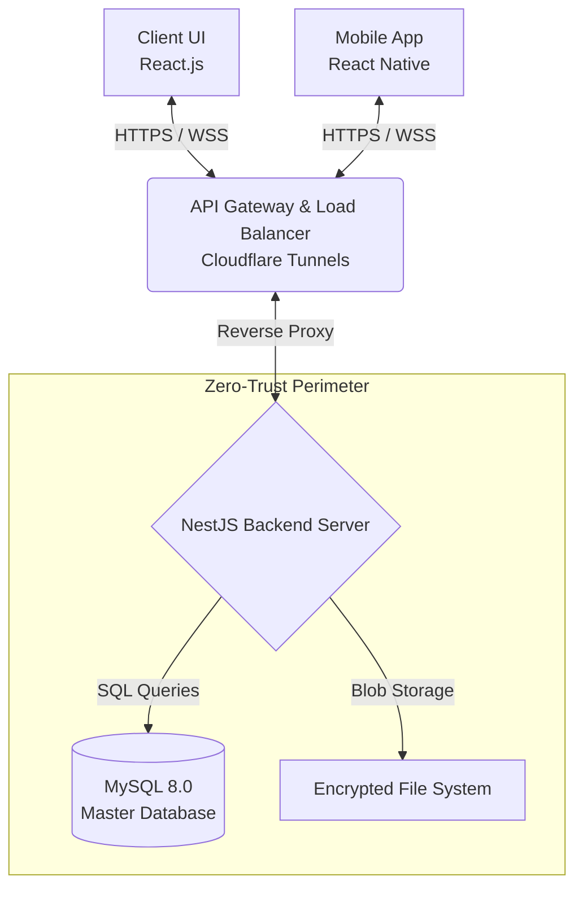

<div align="center">
  
  <h1>CyberSecure Enterprise Platform</h1>
  <p><strong>A Zero-Trust Communication & Secure Document Management System for the Modern Enterprise.</strong></p>

  [](#)
  [](LICENSE)
  [](https://nodejs.org/)
  [](https://nestjs.com/)
  [](https://reactjs.org/)
  [](https://www.docker.com/)
  
  <br />
  <a href="#features">Features</a> &middot;
  <a href="#architecture">Architecture</a> &middot;
  <a href="#quick-start">Quick Start</a> &middot;
  <a href="#documentation">Documentation</a> &middot;
  <a href="#security-specifications">Security</a>
</div>

---

## 📌 Overview

**CyberSecure Enterprise Platform (CSEP)** is an open-source, full-stack enterprise platform engineered from the ground up with a **Zero Trust Architecture** philosophy. It provides organizations with a unified, highly-secure environment for internal communication and mission-critical document management.

By enforcing End-to-End Encryption (E2EE) on real-time messaging pipelines and utilizing AES-256-GCM for file persistence, CSEP guarantees that no intermediary—not even the database or the server administrators—can intercept or read the plaintext contents of your organization's sensitive data.

---

## ✨ Features

### 🔒 Enterprise-Grade Security
- **End-to-End Encryption (E2EE):** Client-side encryption derived from a Master Password and Local PIN via PBKDF2. WebSockets transmit only ciphertexts.
- **Data at Rest Encryption:** All uploaded files are encrypted prior to persistence using AES-256-GCM with SHA-256 integrity checksums.
- **Multi-Factor Authentication (MFA):** TOTP (Time-based One-Time Password) integration for stringent access control.
- **Intrusion Prevention:** Built-in rate limiters, brute-force lockout defenses, and automatic session revocation logic.
- **Comprehensive Audit Trails:** Every major system event, access attempt, and permission elevation is permanently logged for compliance (SOC 2 / HIPAA compliance readiness).

### 💬 Real-Time Encrypted Messaging
- **Lightning-fast WebSockets:** Engineered with `Socket.IO` for instantaneous bidirectional state synchronization.
- **Telegram-style Capabilities:** Supports Direct Messaging, Group Channels, message replies, forwarding, editing, deletion (with tombstone mechanisms), pinning, and reactions.
- **Typing Indicators & Read Receipts:** Encrypted presence tracking.

### 📁 Advanced Vault & File Management
- **Personal & Shared Vaults:** Dedicated workspaces for encrypting and managing sensitive media.
- **File Versioning & Tracking:** Keeps track of file modifications with strict Role-Based Access Control (RBAC).

### 📱 Cross-Platform Accessibility
- **React.js Dashboard:** A premium, glassmorphic administrative control panel built with pure CSS to avoid UI-library bloat.
- **React Native Mobile App:** A high-fidelity, native iOS and Android companion app sharing identical cryptographic algorithms.

---

## 🏛 Architecture

The repository is designed as a Monorepo containing three primary tiers. We employ a modular, loosely-coupled architecture allowing you to scale individual services dynamically.



### Module Breakdown
| Directory | Role | Stack |
| :--- | :--- | :--- |
| `/backend` | The Core API. Handles JWTs, WebSocket orchestration, RBAC, and database interactions via TypeORM. | NestJS, TypeScript, MySQL, Socket.IO |
| `/frontend` | The Administrative Web Portal. Handles cryptographic key-exchanges entirely client-side. | React, Vanilla CSS, Axios |
| `/mobile` | The Native Mobile Client. Provides secure, on-the-go access utilizing SecureStore for key isolation. | React Native, Expo, NativeWind |

---

## 🚀 Quick Start (Docker Environment)

The fastest way to deploy the entire CyberSecure stack locally or on a VPS is by utilizing Docker Compose. 

### Prerequisites
- [Docker Engine](https://docs.docker.com/engine/install/) & [Docker Compose](https://docs.docker.com/compose/install/) (v2.0+)
- Minimum 4GB RAM allocated to Docker.
- Port `3000`, `3001`, and `3307` available.

### Launching the Stack

1. **Clone the repository**
   ```bash
   git clone https://github.com/Wendy84205/K-T-T01.git
   cd K-T-T01
   ```

2. **Spin up the environment**
   The Docker Compose file will automatically provision the MySQL database, execute the TypeORM migrations, boot the NestJS backend, and serve the React frontend.
   ```bash
   docker-compose up --build -d
   ```

3. **Verify Deployment**
   Check the logs to ensure the database migrations propagated successfully:
   ```bash
   docker logs cybersecure-migrate
   docker logs -f cybersecure-backend
   ```

4. **Access the Application**
   - **Web UI:** Navigate to `http://localhost:3000`
   - **Default Admin Credentials:**
     - **Email:** `admin@cybersecure.com`
     - **Password:** `Admin@123456`

---

## 🛠 Local Development Guide

For active development and debugging, you should run the services locally on your host OS.

### 1. Database Setup
Launch only the MySQL container:
```bash
docker-compose up -d mysql
```

### 2. NestJS Backend
```bash
cd backend
npm install

# Run migrations and start the server in watch mode
npm run start:dev
```
*The API will be available at `http://localhost:3001`.*

### 3. React Frontend
```bash
cd frontend
npm install

# Start the Webpack dev server
npm start
```
*The Web UI will be available at `http://localhost:3000`.*

### 4. React Native Mobile App
```bash
cd mobile
npm install

# Start the Expo Metro Bundler
npx expo start
```
*Use the Expo Go app on your phone, or an iOS Simulator / Android Emulator to run the application.*

---

## 🌍 Exposing Locally (Cloudflare Tunnels)

If you are developing the mobile application and testing on a physical device, `localhost` will not resolve. We have provided an automated Cloudflare Tunnel script to expose your local development servers to the internet instantly.

```bash
# Ensure execution permissions
chmod +x scripts/start-tunnels.sh

# Run the tunnel orchestrator
./scripts/start-tunnels.sh
```
The script will return public `*.trycloudflare.com` URLs and automatically inject them into the respective `.env` and `config.js` files across the stack.

---

## 🛡 Security Specifications

CyberSecure does not compromise on cryptographic integrity.

1. **Client-Side Cryptography Pipeline:** 
   - A user's `Master Password` is run through `PBKDF2` with `310,000` iterations to derive a local encryption key.
   - The server pushes an encrypted envelope containing the true `privateKey`.
   - The payload is decrypted strictly in-memory on the client's device. The raw `privateKey` NEVER touches disk or local storage en clair.
2. **Session Lifecycles:** 
   Auth tokens (JWTs) carry a short lifespan. Refresh tokens are restricted to strict `HttpOnly`, `Secure` cookies preventing XSS exfiltration. Invalidating an active session instantly destroys the socket pipeline.
3. **Defense in Depth:**
   All routes utilize NestJS `ValidationPipes` to strip and reject malformed JSON/DTOs. SQL Injection attempts are mitigated entirely via TypeORM's query parameterization.

For a deep dive into the cryptography structure, read the [Security Architecture Document](./docs/SECURITY_ARCHITECTURE.md).

---

## 📖 Documentation

Detailed documentation for individual modules can be found within their respective directories:
- [Backend API Reference & Schema](./backend/README.md)
- [Frontend Architecture & UI System](./frontend/README.md)
- [Mobile App Deployment (APK/IPA) Guide](./mobile/README.md)

---

## 🤝 Contributing

We welcome contributions from the open-source community to fortify and expand the CyberSecure platform.

1. **Fork the repository** on GitHub.
2. **Create a feature branch:** `git checkout -b feature/advanced-biometrics`
3. **Commit your changes:** `git commit -m 'feat(auth): integrate WebAuthn'`
4. **Push to the branch:** `git push origin feature/advanced-biometrics`
5. **Open a Pull Request** against the `main` branch.

Please ensure that your code complies with our internal ESLint rules and that you do not commit any secret `.env` variables. 

---

## 📜 License

This project is licensed under the **MIT License**. See the [LICENSE](LICENSE) file for more details.

---
<div align="center">
  <i>"Privacy is not a feature; it is a fundamental architectural prerequisite."</i>
</div>
