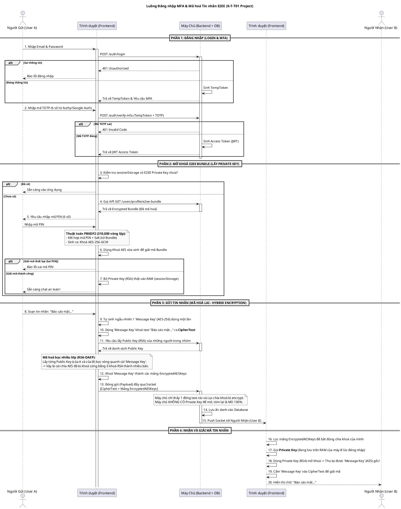

# Sơ đồ Luồng Đăng nhập & Mã hoá Tin nhắn Đầu cuối (E2EE)

Tài liệu này cung cấp **một sơ đồ duy nhất (Flowchart)** thể hiện toàn bộ vòng đời từ lúc người dùng đăng nhập hệ thống cho đến khi gửi và nhận một tin nhắn mã hoá an toàn theo chuẩn E2EE (Mã hoá đầu cuối).

Sơ đồ này kết hợp cơ chế **Xác thực 2 lớp (MFA)** và **Mã hoá Lai (Hybrid Encryption)** sử dụng thuật toán `AES-256-GCM` và `RSA-OAEP-2048`.

---

### Sơ đồ Tổng quát (PlantUML)

Đoạn code dưới đây sử dụng chuẩn **PlantUML**. Bạn có thể copy/paste hoặc render trực tiếp bằng plugin PlantUML của bạn:

---

### Các Thuật toán Mật mã Được Sử Dụng:
1. **Kiểm tra Mật khẩu Đăng nhập:** `Bcrypt` (Database).
2. **Xác thực 2 Bước:** `TOTP` (Time-Based One Time Password).
3. **Chống Brute-force mã PIN:** `PBKDF2` với `310,000` Iterations (Sinh key cực chậm, cực an toàn theo chuẩn OWASP).
4. **Mã hoá Chìa khoá AES (Để gửi):** `RSA-OAEP-2048` (Mã hoá bất đối xứng cực mạnh).
5. **Mã hoá Nội dung Chat thực tế:** `AES-256-GCM` (Mã hoá đối xứng tốc độ cao).
