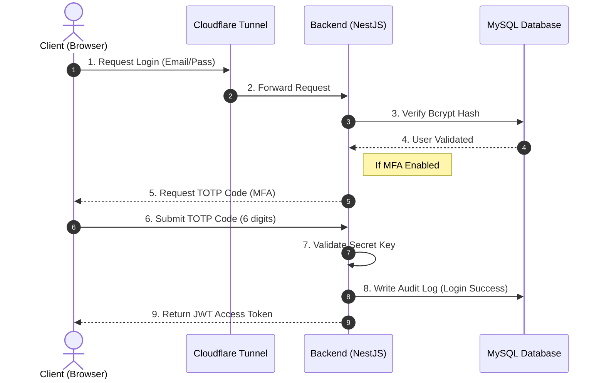
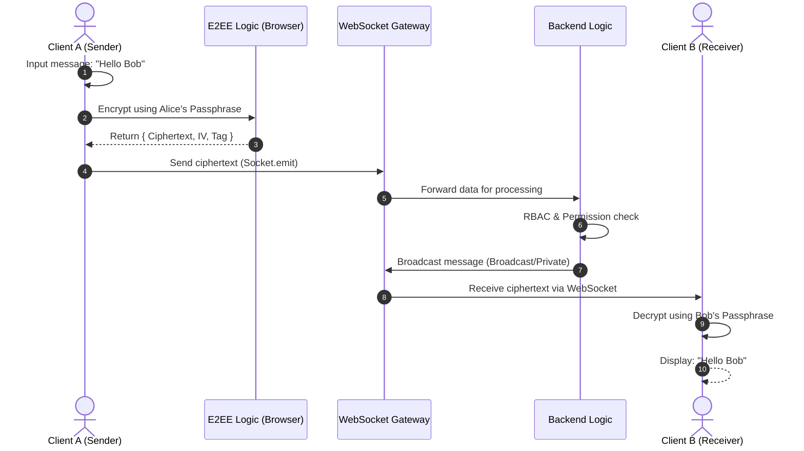
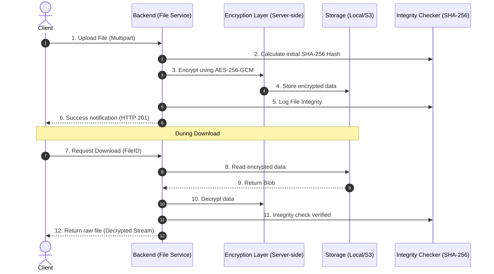

# Client Interaction Detailed Flows (UML)

This document focuses on the interaction flows between the **Client (User)** and other system components (Backend, Database, Storage, Security) through UML Sequence Diagrams.

---

## 1. Authentication & Security Flow (Auth & MFA)
Describes how the Client interact with the Backend for secure login.

---

## 2. End-to-End Encrypted Messaging (E2EE Chat Flow)
Describes the real-time interaction via WebSocket and client-side E2EE processing.

---

## 3. Secure File Management Flow
Describes the interactions when uploading/downloading encrypted files.

---

## 4. Interaction Summary
- **Client - Cloudflare:** Secure HTTPS/SSL connection over the Internet.
- **Client - Backend:** Stateless exchange using JWT Tokens in Authorization Header.
- **Client - WebSocket:** Persistent full-duplex connection for instant updates.
- **Backend - Storage:** Encrypted binary streams for sensitive data protection at rest.
