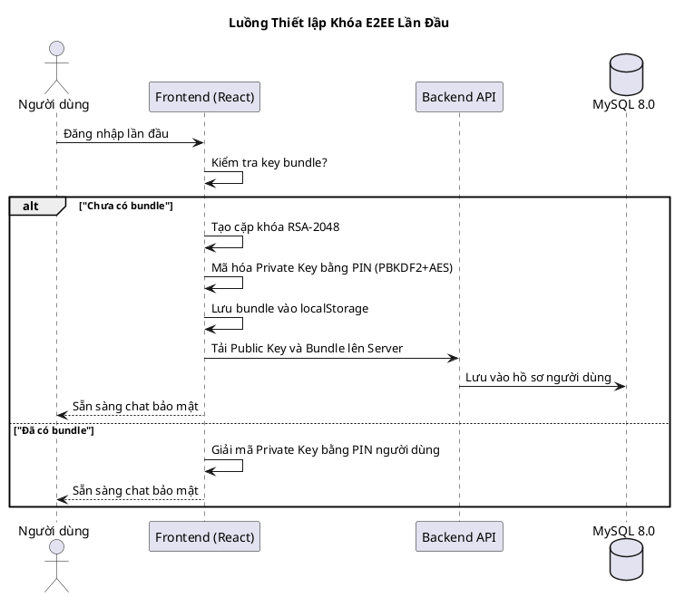
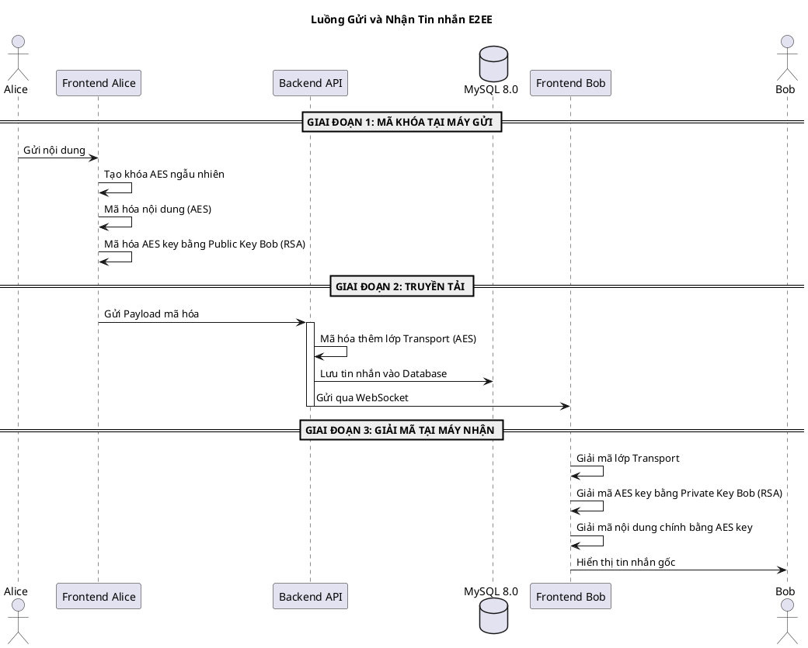

# Sơ đồ Chi tiết: Luồng Tin nhắn Mã hoá (E2EE)

Hệ thống KTT01 sử dụng **hai lớp mã hoá độc lập** để bảo vệ tin nhắn. Tài liệu này mô tả toàn bộ luồng từ lúc người dùng gõ nội dung cho đến khi tin nhắn được hiển thị an toàn.

---

## Kiến trúc 2 lớp mã hoá

| Lớp | Tên | Thuật toán | Vị trí | Mục đích |
|-----|-----|------------|--------|---------|
| **Layer 1** | Transport Encryption | `AES-256-GCM` | Backend | Bảo vệ dữ liệu khi lưu xuống Database |
| **Layer 2** | E2EE Hybrid Encryption | `AES-256-GCM` + `RSA-OAEP` | Frontend | Chỉ người nhận có Private Key mới đọc được |

---

## Sơ đồ 1: Thiết lập Khóa E2EE (Lần đầu đăng nhập)

---

## Sơ đồ 2: Gửi & Nhận Tin nhắn (E2EE)

---

## Tóm tắt Công nghệ

| Công nghệ | Thư viện | Vị trí | Mục đích |
|-----------|----------|--------|---------|
| **AES-256-GCM** | `window.crypto.subtle` | Frontend | Mã hóa nội dung tin nhắn Payload |
| **RSA-OAEP-2048**| `window.crypto.subtle` | Frontend | Mã hóa/Bọc khóa AES cho từng người nhận |
| **PBKDF2** | `window.crypto.subtle` | Frontend | Băm mã PIN (310k vòng) bảo vệ Private Key |
| **Bcrypt** | `bcrypt` | Backend | Băm mật khẩu đăng nhập hệ thống |
