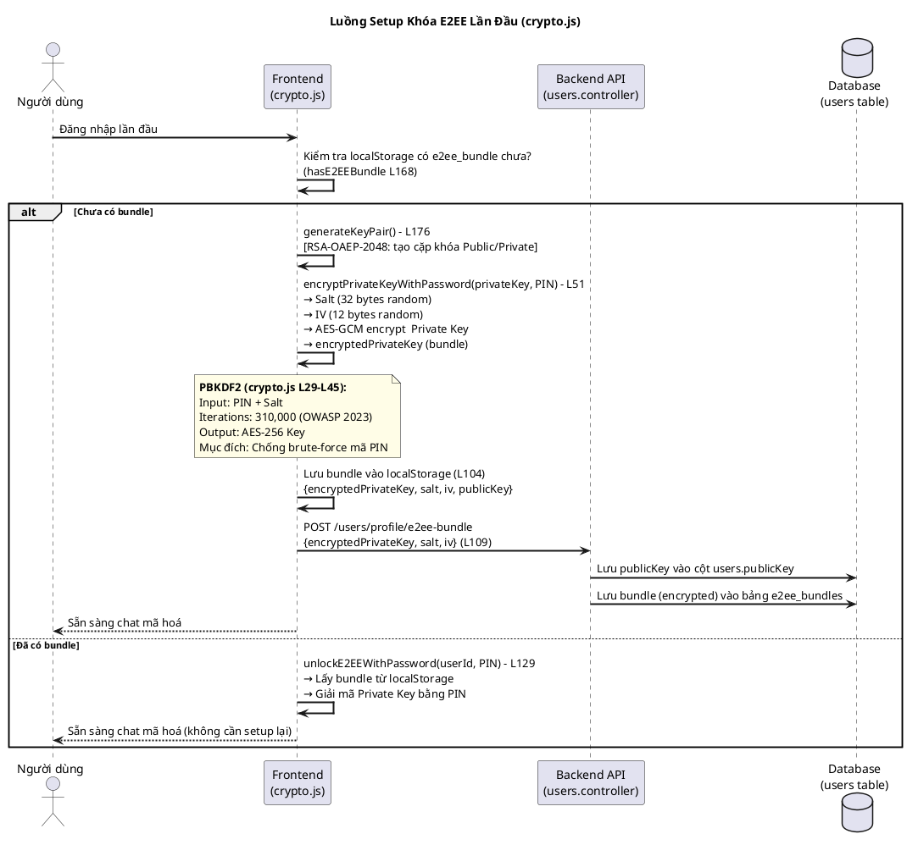
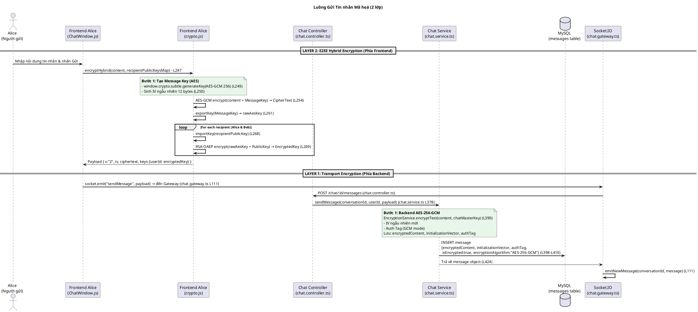
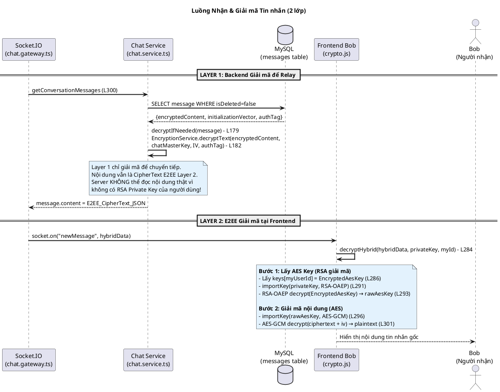

# Sơ đồ Chi tiết: Luồng Tin nhắn Mã hoá (E2EE)

Hệ thống KTT01 sử dụng **hai lớp mã hoá độc lập** để bảo vệ tin nhắn. Tài liệu này mô tả toàn bộ luồng từ lúc người dùng gõ nội dung cho đến khi tin nhắn được hiển thị an toàn ở phía người nhận.

---

## Kiến trúc 2 lớp mã hoá

| Lớp | Tên | Thuật toán | Nơi thực thi | Ghi chú |
|-----|-----|------------|--------------|---------|
| **Layer 1** | Transport Encryption | `AES-256-GCM` | `chat.service.ts` (Backend) | Bảo vệ dữ liệu khi lưu xuống Database |
| **Layer 2** | E2EE Hybrid Encryption | `AES-256-GCM` + `RSA-OAEP-2048` | `crypto.js` (Frontend) | Chỉ người nhận có Private Key mới đọc được |

---

## Sơ đồ 1: Setup Khóa E2EE (Lần đầu đăng nhập)

---

## Sơ đồ 2: Gửi Tin nhắn (2 lớp mã hoá)

---

## Sơ đồ 3: Nhận & Giải mã Tin nhắn

---

## Tóm tắt Công nghệ

| Công nghệ | Vị trí | Dòng code | Mục đích |
|-----------|--------|-----------|---------|
| `AES-256-GCM` (Backend) | `chat.service.ts` | L390, L499 | Mã hoá transport, bảo vệ Database |
| `EncryptionService` | `encryption.service.ts` | L182 | Service tiện ích mã hoá/giải mã AES |
| `AES-256-GCM` (Frontend) | `crypto.js` | L249–L257 | Mã hoá nội dung tin nhắn E2EE |
| `RSA-OAEP-2048` | `crypto.js` | L267–L270 | Bọc/khoá AES key cho từng người nhận |
| `PBKDF2 (310,000 rounds)` | `crypto.js` | L19, L38 | Bảo vệ Private Key bằng mã PIN |
| `Web Crypto API` | `crypto.js` | Toàn file | Native browser API, không có thư viện bên ngoài |
| `Socket.IO` | `chat.gateway.ts` | L111 | Real-time relay tin nhắn |
| `speakeasy` (TOTP) | `mfa.service.ts` | L69 | Xác thực 2 bước khi đăng nhập |

---

## Câu hỏi thường gặp

### Tại sao có 2 lớp mã hoá?
- **Layer 1 (Backend)** bảo vệ dữ liệu trong DB nếu server bị tấn công — nhưng server vẫn đọc được (có master key).
- **Layer 2 (Frontend E2EE)** đảm bảo ngay cả server cũng không đọc được nội dung. Chỉ người có `Private Key` mới giải mã được.

### Server có thể đọc tin nhắn không?
Không. Server chỉ lưu `CipherText` (văn bản đã mã hoá bằng E2EE). Để đọc được cần `Private Key (RSA)` của người nhận, mà `Private Key` này **không bao giờ rời khỏi thiết bị người dùng** — nó nằm trong `sessionStorage` (RAM) của trình duyệt.

### Tại sao cần RSA bọc AES key?
Vì AES là mã hoá **đối xứng** (cùng 1 key để mã hoá và giải mã). Trong nhóm chat nhiều người, không thể chia sẻ key AES an toàn. RSA cho phép mỗi người nhận nhận một bản `AES key` được bọc riêng bằng `Public Key` của họ — chỉ `Private Key` tương ứng mới giải ra được.
