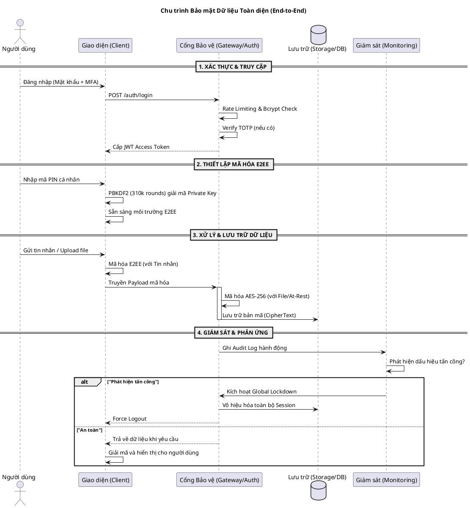

# Kiến trúc Bảo mật Tổng thể (Security Architecture) — CSEP KTT01

Tài liệu này cung cấp cái nhìn toàn cảnh về các lớp bảo mật đan xen, bảo vệ dữ liệu từ lúc người dùng đăng nhập cho đến khi dữ liệu được mã hóa lưu trữ lâu dài.

---

## Sơ đồ Tổng thể: Chu trình Bảo mật Dữ liệu

Dưới đây là sơ đồ dòng chảy dữ liệu qua các "chốt chặn" bảo mật của hệ thống:

---

## Các lớp bảo mật chính (Defense in Depth)

| Lớp | Công nghệ | Mục tiêu |
|---|---|---|
| **Lớp 1: Xác thực** | JWT, MFA (TOTP), Bcrypt | Đảm bảo đúng người dùng truy cập |
| **Lớp 2: Truyền tải** | Cloudflare Tunnels (TLS) | Chống nghe lén trên đường truyền |
| **Lớp 3: Liên lạc** | E2EE (Web Crypto API) | Bảo vệ tin nhắn, kể cả admin cũng không đọc được |
| **Lớp 4: Lưu trữ** | AES-256-GCM (Backend) | Bảo vệ tệp tin khi lưu trên đĩa (Disk) |
| **Lớp 5: Chính trực** | SHA-256 | Đảm bảo file không bị sửa đổi trái phép |
| **Lớp 6: Giám sát** | Audit Logs, Global Lockdown | Phản ứng nhanh khi có sự cố |

---

## Tham khảo chi tiết
- [Luồng Đăng nhập & Đặt lại mật khẩu](./TECHNICAL_FLOWS.md)
- [Cơ chế mã hóa tin nhắn E2EE](./E2EE_MESSAGE_FLOW.md)
- [Kiểm tra tính toàn vẹn tệp tin](./TECHNICAL_FLOWS.md)
