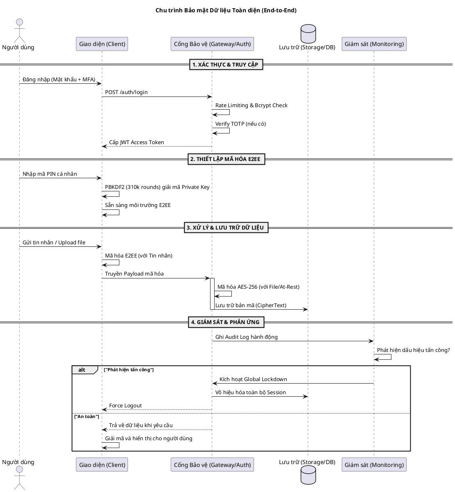

# Kiến trúc Bảo mật Tổng thể (Security Architecture) — CSEP KTT01

Tài liệu này cung cấp cái nhìn toàn cảnh về các lớp bảo mật đan xen, bảo vệ dữ liệu từ lúc người dùng đăng nhập cho đến khi dữ liệu được mã hóa lưu trữ lâu dài.

---

## Sơ đồ Tổng thể: Chu trình Bảo mật Dữ liệu

Dưới đây là sơ đồ dòng chảy dữ liệu qua các "chốt chặn" bảo mật của hệ thống:



---

## Các lớp bảo mật chính (Defense in Depth)

| Lớp | Công nghệ | Mục tiêu |
|---|---|---|
| **Lớp 1: Xác thực** | JWT, MFA (TOTP), Bcrypt | Đảm bảo đúng người dùng truy cập |
| **Lớp 2: Truyền tải** | Cloudflare Tunnels (TLS) | Chống nghe lén trên đường truyền |
| **Lớp 3: Liên lạc** | E2EE (Web Crypto API) | Bảo vệ tin nhắn, kể cả admin cũng không đọc được |
| **Lớp 4: Lưu trữ** | AES-256-GCM (Backend) | Bảo vệ tệp tin khi lưu trên đĩa (Disk) |
| **Lớp 5: Chính trực** | SHA-256 | Đảm bảo file không bị sửa đổi trái phép |
| **Lớp 6: Giám sát** | Audit Logs, Global Lockdown | Phản ứng nhanh khi có sự cố |

---

## Tham khảo chi tiết
- [Luồng Đăng nhập & Đặt lại mật khẩu](./TECHNICAL_FLOWS.md)
- [Cơ chế mã hóa tin nhắn E2EE](./E2EE_MESSAGE_FLOW.md)
- [Kiểm tra tính toàn vẹn tệp tin](./TECHNICAL_FLOWS.md)

---

## Security Audit Log — Các lỗ hổng đã được vá

| # | Tên | Mức độ | Trạng thái | File |
|---|-----|--------|------------|------|
| 6 | CORS Misconfiguration | HIGH | ✅ FIXED | `main.ts` |
| 7 | Access Token in localStorage | MEDIUM | ✅ FIXED | `AuthContext`, `api.js` |
| **8** | **Session Leakage — Refresh Token Re-use sau Logout** | **CRITICAL** | **✅ FIXED** | `auth.service.ts`, `auth.controller.ts` |
| 9 | Missing API Rate Limiting (DoS/DDoS) | MEDIUM | ✅ FIXED | `main.ts` |
| 10 | Missing Security Headers (Helmet) | MEDIUM | ✅ FIXED | `main.ts` |

---

## LỖ HỔNG 8: Session Leakage — Chi tiết Fix

### Vấn đề (Before)
Hàm `refreshToken()` chỉ kiểm tra chữ ký JWT (`jwtService.verify()`), bỏ qua hoàn toàn trạng thái
`revokedAt` trong database. Hacker sở hữu cookie `refresh_token` vẫn có thể gọi `/auth/refresh`
để lấy `access_token` mới **ngay cả sau khi Victim đã logout hoặc đổi mật khẩu**.

### Giải pháp (After)
1. **DB Session Check**: Query `user_sessions` tìm session theo `userId` + `refreshToken` + `revokedAt IS NULL`.
   Nếu session đã bị revoked → trả 401 ngay lập tức + ghi log `REFRESH_TOKEN_REUSE_ATTEMPT` (severity: HIGH).
2. **Refresh Token Rotation**: Mỗi lần refresh thành công:
   - Session cũ bị đánh dấu `revokedAt` (lý do: `Token rotated on refresh`)  
   - Một `newRefreshToken` mới được ký và lưu vào session mới  
   - Cookie `refresh_token` được cập nhật bằng token mới qua `Set-Cookie`  
   → Kẻ tấn công có token cũ sẽ bị chặn ngay lần gọi tiếp theo.

### Attack Surface After Fix
```
Logout (revokedAt = NOW)
  └─→ Hacker gọi /auth/refresh với token cũ
        └─→ DB check: revokedAt IS NOT NULL → Session not found
              └─→ HTTP 401 "Session has been revoked"
                    └─→ Log: REFRESH_TOKEN_REUSE_ATTEMPT [HIGH]
```

---

## Rate Limiting Policy (main.ts)

| Endpoint | Giới hạn | Cửa sổ |
|----------|----------|--------|
| `/auth/login` | 20 req/IP | 1 phút |
| `/auth/refresh` | 30 req/IP | 1 phút |
| `/auth/verify-mfa` | 10 req/IP | 1 phút |
| `/auth/forgot-password` | 5 req/IP | 15 phút |
| `/auth/reset-password` | 5 req/IP | 15 phút |
| Toàn bộ `/api/v1` | 120 req/IP | 1 phút |

Trả về HTTP **429 Too Many Requests** + header `Retry-After` + `X-RateLimit-*` khi vượt ngưỡng.

---

## Security Headers — Helmet (main.ts)

| Header | Giá trị | Mục tiêu |
|--------|---------|----------|
| `X-Frame-Options` | SAMEORIGIN | Chống Clickjacking |
| `X-Content-Type-Options` | nosniff | Chống MIME Sniffing |
| `X-XSS-Protection` | 1; mode=block | Bảo vệ XSS cơ bản |
| `Strict-Transport-Security` | max-age=15552000 | Bắt buộc HTTPS |
| `Content-Security-Policy` | `default-src 'self'` | Kiểm soát tài nguyên |

WebSocket được thêm vào `connectSrc: ['self', 'wss:', 'ws:']` để không break chat.
