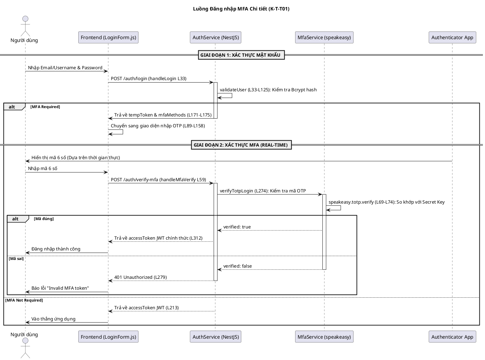
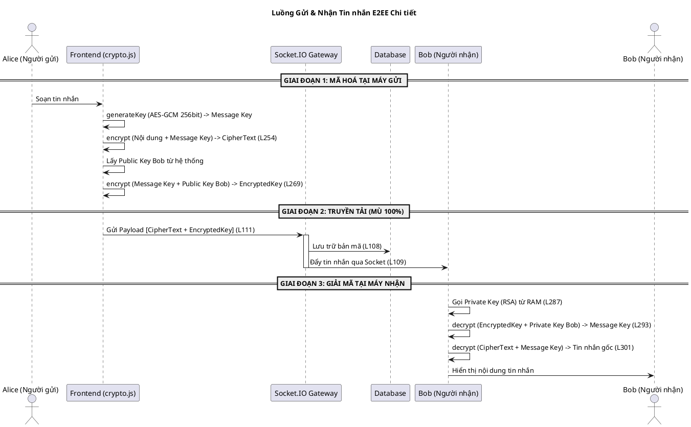

# Tài liệu Kỹ thuật: Luồng Đăng nhập & Tin nhắn E2EE

Tài liệu này chi tiết hóa các quy trình kỹ thuật cốt lõi của hệ thống KTT01, bao gồm tham chiếu dòng code và giải thích công nghệ.

---

## 1. Luồng Đăng nhập & Xác thực Đa nhân tố (MFA)

Luồng này kết hợp xác thực mật khẩu truyền thống với mã TOTP (Time-based One-Time Password) để đảm bảo an toàn tuyệt đối.

### Sơ đồ Luồng Chi tiết

### Chi tiết Công nghệ & Cơ chế
- **Bcrypt:** Dùng để băm mật khẩu (`auth.service.ts:L81`).
- **TOTP (RFC 6238):** Sử dụng thư viện `speakeasy`.
- **Tại sao lại xác nhận Real-time?** Mã 6 số được sinh ra dựa trên thuật toán kết hợp giữa **Shared Secret Key** và **Unix Time** (thời gian hiện tại). Cứ mỗi 30 giây mã sẽ thay đổi. Backend dùng cùng Secret Key và thời gian hiện tại để tính toán mã; nếu khớp thì xác nhận thành công.
- **Dòng code then chốt:**
    - Backend: `auth.service.ts` dòng 232 (`verifyMfaAndLogin`), `mfa.service.ts` dòng 69 (`speakeasy.totp.verify`).
    - Frontend: `LoginForm.js` dòng 33 (`api.login`) và dòng 59 (`api.verifyMfa`).

---

## 2. Luồng Gửi & Nhận Tin nhắn Mã hoá (E2EE)

Hệ thống sử dụng **Mã hoá Lai (Hybrid Encryption)**: AES cho nội dung và RSA cho chìa khoá.

### Sơ đồ Luồng Chi tiết

### Chi tiết Công nghệ
- **Web Crypto API (`window.crypto.subtle`):** Thư viện native của trình duyệt, cực kỳ nhanh và an toàn.
- **AES-256-GCM:** Mã hoá đối xứng dùng để khoá nội dung tin nhắn vì tốc độ nhanh (`crypto.js:L14-L17`).
- **RSA-OAEP-2048:** Mã hoá bất đối xứng dùng để bọc "chìa khoá" AES (`crypto.js:L7-L12`).
- **Dòng code then chốt:**
    - Frontend Mã hoá: `crypto.js` dòng 247 (`encryptHybrid`).
    - Frontend Giải mã: `crypto.js` dòng 284 (`decryptHybrid`).
    - Backend Trung chuyển: `chat.gateway.ts` dòng 111 (`emitNewMessage`).

---

## 3. Tại sao hệ thống an toàn?
1. **Zero Knowledge:** Máy chủ chỉ lưu `CipherText` (văn bản rác) và `EncryptedKey` (chìa khoá bị khoá). Máy chủ KHÔNG có `Private Key` nên không thể đọc được nội dung.
2. **PBKDF2 (310,000 vòng):** Được dùng để bảo vệ `Private Key` bằng mã PIN của người dùng (`crypto.js:L19`). Ngay cả khi hacker lấy được file bundle trên server, họ cũng mất hàng chục năm để brute-force mã PIN.
