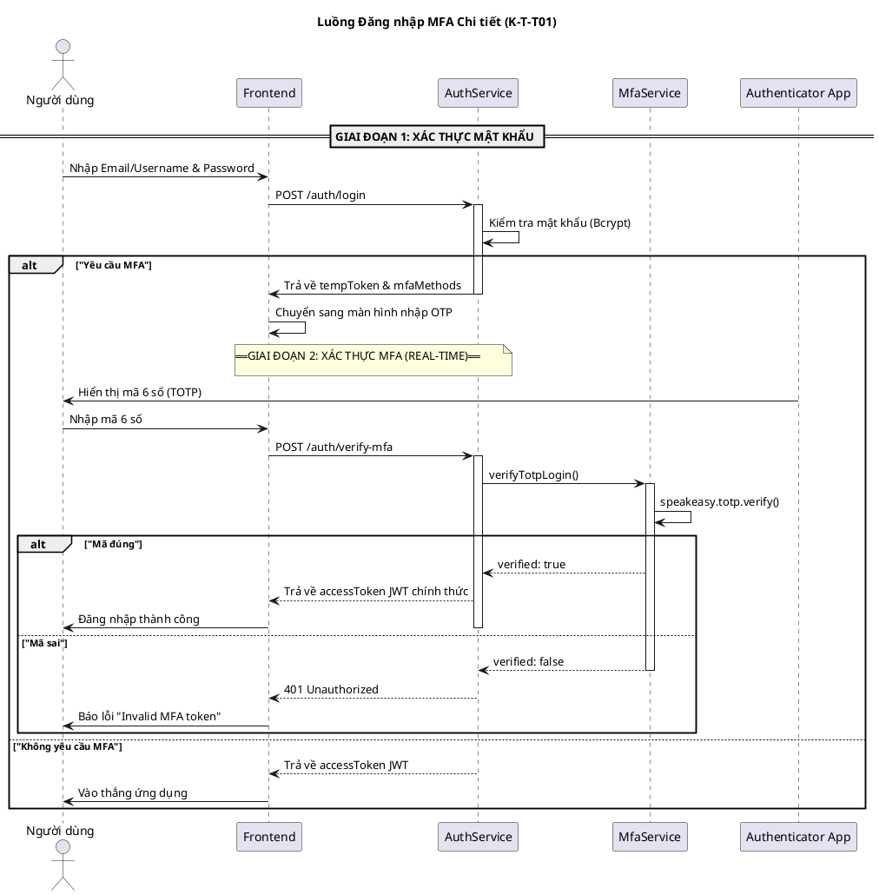
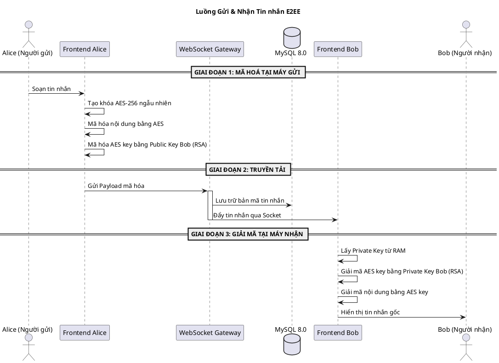
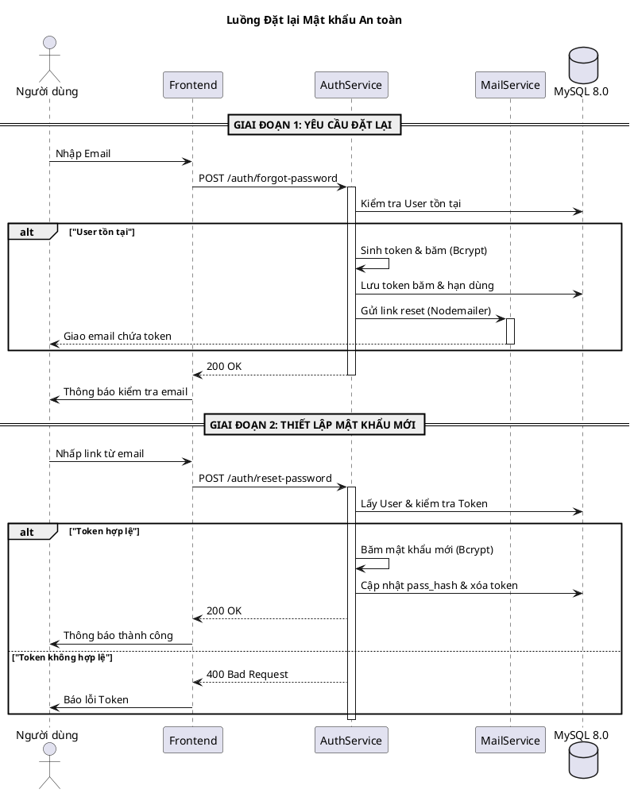
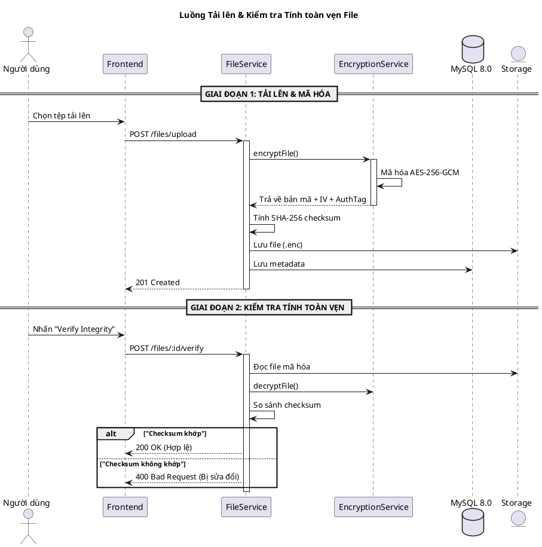
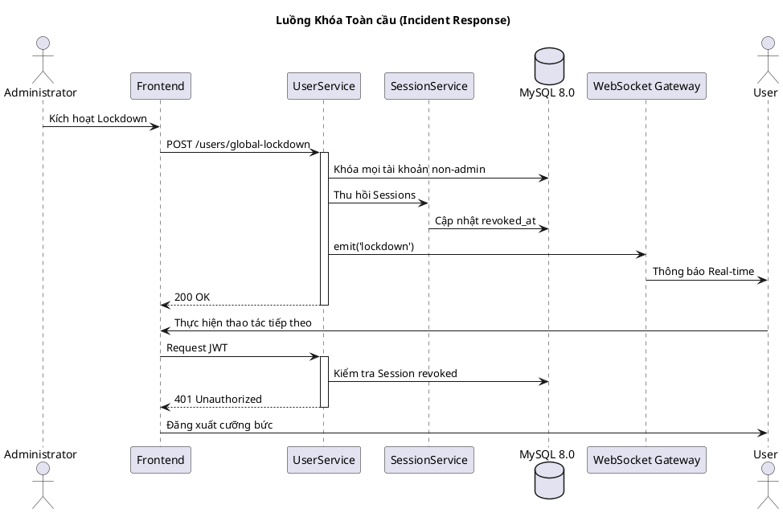

# Tài liệu Kỹ thuật: Luồng Đăng nhập & Tin nhắn E2EE

Tài liệu này chi tiết hóa các quy trình kỹ thuật cốt lõi của hệ thống KTT01, bao gồm tham chiếu dòng code và giải thích công nghệ.

---

## 1. Luồng Đăng nhập & Xác thực Đa nhân tố (MFA)

Luồng này kết hợp xác thực mật khẩu truyền thống với mã TOTP (Time-based One-Time Password) để đảm bảo an toàn tuyệt đối.

### Sơ đồ Luồng Chi tiết

### Chi tiết Công nghệ & Cơ chế
- **Bcrypt**: Dùng để băm mật khẩu bảo mật (`auth.service.ts`).
- **Speakeasy**: Thư viện xử lý mã TOTP (`mfa.service.ts`).
- **JWT**: Token xác thực phiên làm việc (`@nestjs/jwt`).

---

## 2. Luồng Gửi & Nhận Tin nhắn Mã hoá (E2EE)

### Sơ đồ Luồng Chi tiết

---

## 3. Luồng Đặt lại Mật khẩu (Forgot/Reset Password)

---

## 4. Luồng Quản lý Tài liệu & Kiểm tra Tính toàn vẹn (File Integrity)

---

## 5. Luồng Khóa Toàn cầu (Global Lockdown)

